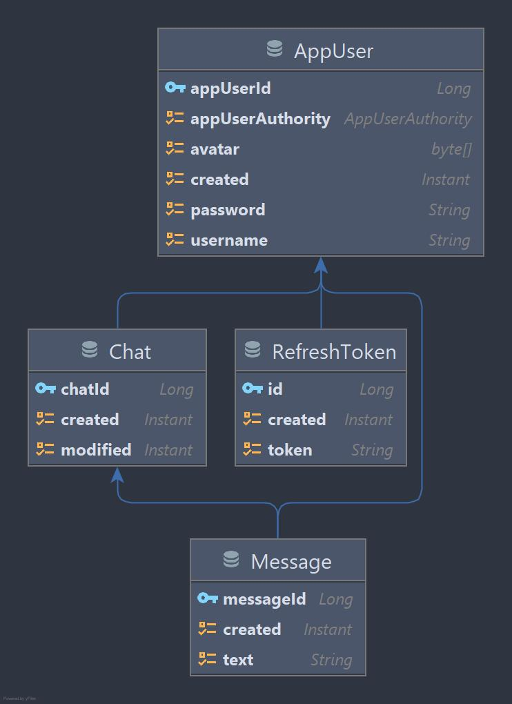

# InfinityChat

An instant messaging application built in Spring

> Java Spring-MVC Spring-Boot Spring-Security STOMP websocket JPA PostgreSQL

The backend application relies mostly on REST to store or retrieve data with websockets being used for realtime functionality. The application is secured with access tokens (JSON Web Tokens) which are as short-lived as possible. Refresh tokens are used to generate new access tokens.

Here is source code for the [frontend application](https://github.com/badass-techie/InfinityChat), and a [live demo]().

## Database Schema

